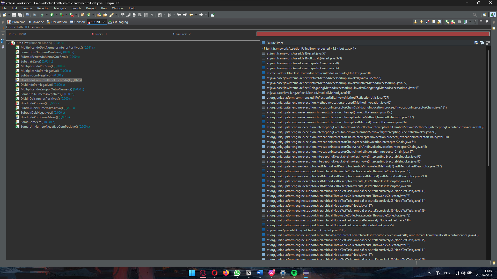

# CalculadoraJunity
## Descrição
O Projeto foi desenvolvido em Java utilizando a biblioteca Junit5(Junit Jupiter), idealizado para teste de uma calculadora com soma, subtração, divisão e multiplicação
## Mecânicas
Dentro da nossa calsse main nos usamos a biblioteca Junit para testar os limites Logicos e tecnologicos do programa em desenvolvimento. Feito com ideal de introdução a teste de software
## Funcionamento
Print do funcionamento da biblioteca

## Última atualização 20/09/2023
